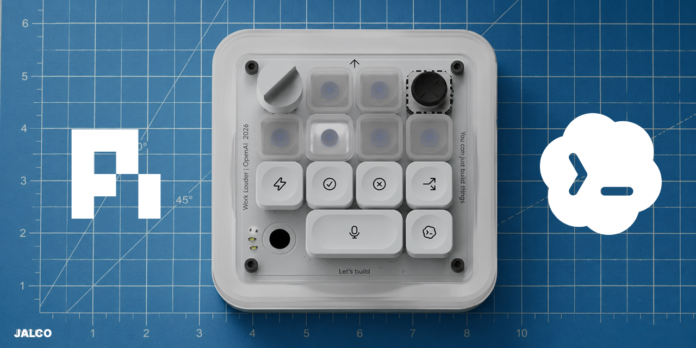

<p align="center">
  <a href="https://worklouder.cc/codex-micro">
    
  </a>
</p>

<p align="center">
  Command keys, dial, and joystick drive <a href="https://github.com/badlogic/pi-mono">pi</a>; pi drives the agent-state LEDs back.
</p>

<p align="center">
  <a href="https://www.npmjs.com/package/pi-codex-micro"></a>
  <a href="LICENSE"></a>
  <a href="https://github.com/jal-co/pi-codex-micro/commits/main"></a>
  <a href="https://github.com/badlogic/pi-mono"></a>
  <a href="https://worklouder.cc/codex-micro"></a>
  <a href="https://openai.com"></a>
</p>

---

## Status

- **Input side: working.** Keys, dial, and joystick are mapped through
  Work Louder Input to keystrokes that pi shortcuts handle.
- **Simulator: working, multi-agent.** `/codex-micro sim` opens a
  browser-based virtual Codex Micro. Every running pi session (each
  zentty pane) occupies one agent key with its own live state; inputs
  route to whichever agent is selected. No hardware needed.
- **Output side: scaffolded.** The LED protocol is undocumented, so the
  extension ships with a mock transport. See
  [docs/protocol-discovery.md](docs/protocol-discovery.md) for the plan
  to fill in `src/protocol.ts` once the hardware arrives, then flip
  `"transport": "hid"`.

## Install

```bash
cd ~/Documents/GitHub/pi-codex-micro && npm install
```

Add to `~/.pi/agent/settings.json`:

```json
{
  "extensions": ["/Users/justin/Documents/GitHub/pi-codex-micro/src/index.ts"]
}
```

Then `/reload` in pi.

## Device mapping (Work Louder Input)

Map the Micro's physical controls to these keystrokes in the Input
configurator. Native pi keybindings cover half the surface; extension
shortcuts cover the rest.

| Control | Keystroke | Action in pi |
|---|---|---|
| Accept key | `enter` | Submit / confirm dialogs |
| Reject key | `escape` | Interrupt / cancel dialogs |
| New chat key | `ctrl+alt+n`* | New session |
| Model key | `ctrl+p` | Cycle model |
| Thinking key | `shift+tab` | Cycle thinking level |
| Dial CW | `ctrl+alt+=` | Thinking level up |
| Dial CCW | `ctrl+alt+-` | Thinking level down |
| Joystick up | `ctrl+alt+i` | Skill slot 1 |
| Joystick down | `ctrl+alt+k` | Skill slot 2 |
| Joystick left | `ctrl+alt+j` | Skill slot 3 |
| Joystick right | `ctrl+alt+l` | Skill slot 4 |

\* Bind in `~/.pi/agent/keybindings.json`:

```json
{
  "app.session.new": ["ctrl+alt+n"]
}
```

Push-to-talk is handled on the OS side (map the touch sensor to your
dictation hotkey); the transcript lands in pi's editor like any typed
prompt.

## Terminal support

Pane jumping is terminal-agnostic: each pi session detects its own
terminal at startup and executes its own focus command when the sim
forwards a jump, so panes in different terminals coexist on one page.

| Terminal | Detection | Jump behavior |
|---|---|---|
| Zentty | `ZENTTY_PANE_ID` | Focus exact pane + activate app |
| tmux | `TMUX_PANE` | Select window + pane + client |
| WezTerm | `WEZTERM_PANE` | `wezterm cli activate-pane` |
| Kitty | `KITTY_WINDOW_ID` | `kitten @ focus-window` (needs `allow_remote_control`) |
| iTerm2 / Terminal / Ghostty / VS Code / Warp / others | `TERM_PROGRAM` | Activate the app (no pane API) |
| Anything else | `focusCommand` config | Runs your argv as-is |

Custom override in `codex-micro.json`:

```json
{
  "focusCommand": ["tmux", "select-pane", "-t", "%3"]
}
```

Sessions that cannot focus still show up on the page; the jump
affordance just reports it is unavailable.

## Configuration

`~/.pi/agent/codex-micro.json` (all fields optional):

```json
{
  "transport": "mock",
  "agentSlot": 0,
  "joystick": {
    "up": "/skill:impeccable",
    "down": "/skill:git",
    "left": "Review my latest changes and point out problems.",
    "right": "Continue where you left off."
  },
  "commandKeys": {
    "ctrl+alt+r": "/reload"
  }
}
```

Joystick and command-key values are sent as pi input, so slash commands,
`/skill:name`, and plain prompts all work.

## Simulator

Run `/codex-micro sim` in pi. A local page opens showing the device.

The session that runs it hosts the hub on port 7327; every other pi
session auto-joins on creation (and keeps probing, so sessions started
before the sim hop on within seconds). Each session takes one agent
key, labeled with its project directory. Sessions never host on their
own: when the pi hosting the sim exits, the sim dies with it, and the
remaining sessions go dormant until someone runs `/codex-micro sim`
again. The one exception is `/reload` of the hosting pane, which
re-hosts in place so code upgrades apply without killing the page.

The page renders the device entirely in CSS after the real hardware:
white case, frosted plate with corner screws and edge text, dial
top-left, joystick top-right, six translucent RGB agent keys (two on
the top row, four on row two), a row of white icon keys, the mic
cluster, the wide "Let's build" key, and the test key. The case
exterior glows in the selected agent's state color.

- **Agent keys** glow with each session's live state (thinking pulses
  amber, complete green, needs-input blue, error red); click one to
  jump straight to that session's terminal pane, like pressing an
  agent key on the real device; shift-click or the 1-6 number keys
  target an agent for the controls without switching panes; clicking
  a dimmed (disconnected) key removes it immediately
- **Six agent keys**, matching the device; sessions beyond six wait
  and join automatically when a key frees
- **Slots are sticky:** a dropped session keeps its key for 10 seconds
  so reconnects, `/new`, and `/reload` never reshuffle the row; the
  hub itself survives `/reload` and `/new` (it only shuts down when pi
  exits), and keys dim while a session is briefly offline
- **Joystick** arrows fire the selected session's four skill/prompt slots
- **Dial** halves step the selected session's thinking level
- **Icon keys**: check accepts (`commandKeys["sim:accept"]`, default
  "Looks good, proceed."), cross aborts the current run, the wide mic
  key sends `commandKeys["sim:new"]` (default `/new`), and the
  scribble key cycles all LED states
- **Lightning / arrow keys** send `commandKeys["sim:k1"]` and
  `commandKeys["sim:k2"]`
- Keyboard works too: arrows = joystick, `+`/`-` = dial, Esc = stop

State flows over Server-Sent Events; clicks POST back into the
extension and become ordinary pi input. `scripts/sim-smoke.ts`
(`npx tsx scripts/sim-smoke.ts`) smoke-tests the server headlessly.

## Commands

| Command | Action |
|---|---|
| `/codex-micro status` | Transport, state, and config summary |
| `/codex-micro sim` | Start the browser simulator and open it |
| `/codex-micro sim stop` | Stop the simulator server |
| `/codex-micro leave` | Drop this session off the mesh (frees its agent key immediately) |
| `/codex-micro join` | Rejoin the mesh after leaving |
| `/codex-micro connect` | (Re)connect the HID device |
| `/codex-micro disconnect` | Close the HID device |
| `/codex-micro test` | Cycle all five LED states |

## LED state mapping

| pi lifecycle | Device state |
|---|---|
| Session start / user typing | idle |
| Agent running | thinking |
| Run settled, last message ends with `?` | needs input |
| Run settled cleanly | complete |
| Run settled after an error stop | error |

## Layout

```
src/
  index.ts          extension entry (shortcuts, commands, events)
  state.ts          pi lifecycle -> agent-state mapping
  transport.ts      DeviceTransport interface
  hid-transport.ts  node-hid implementation
  mock-transport.ts no-hardware fallback
  protocol.ts       HID report constants (placeholders until sniffed)
  sim.ts            hub-or-client facade with failover
  sim-server.ts     multi-session hub (page, SSE, action routing)
  sim-client.ts     client for sessions joining an existing hub
  sim-shared.ts     wire types, fixed port, slot count
  sim-page.ts       simulator device page (single-file HTML)
  terminal.ts       terminal detection + pane-focus adapters
  config.ts         ~/.pi/agent/codex-micro.json loader
scripts/
  sim-smoke.ts      headless simulator smoke test
  tegami.mts        release configuration
docs/
  protocol-discovery.md  reverse-engineering plan
```

## Releases

Releases run through [Tegami](https://tegami.fuma-nama.dev). Write a
changelog file under `.tegami/` with your change; CI opens a Version
Packages PR on main, and merging it publishes to npm and cuts a GitHub
release.

## License

[MIT](LICENSE)
